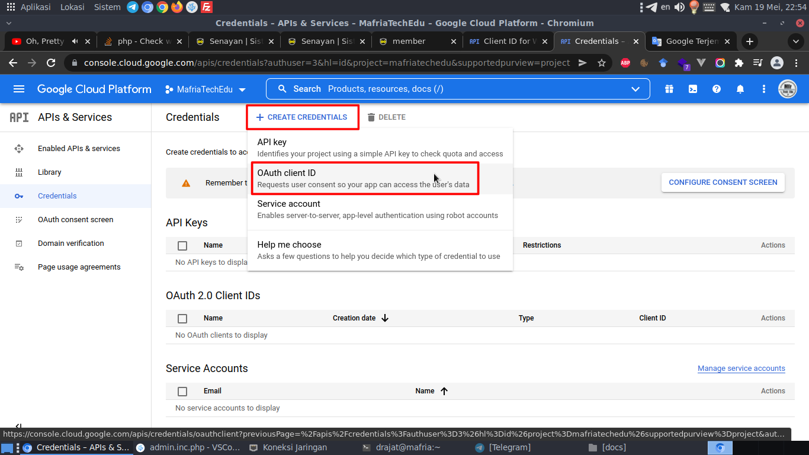
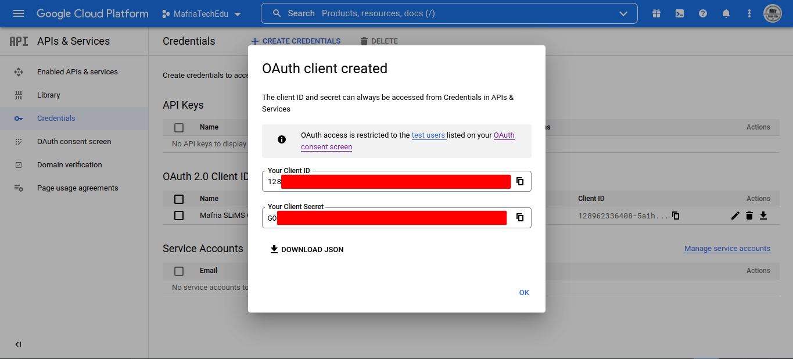
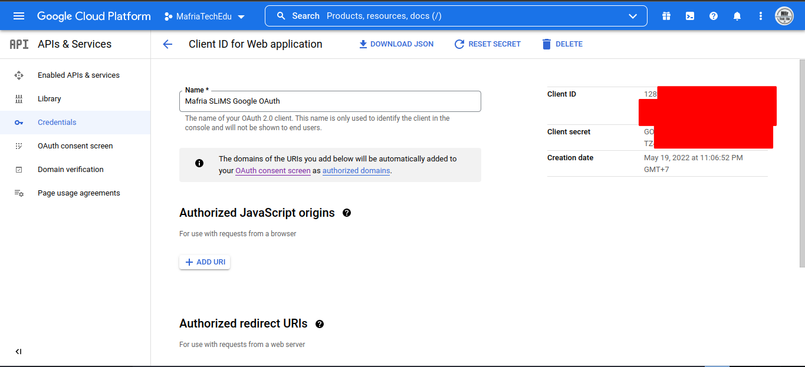
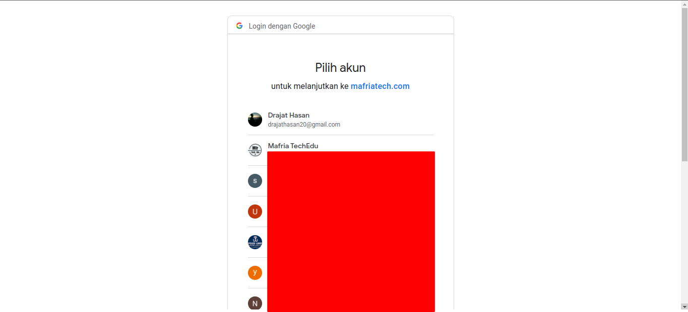

# SLiMS OAuth Plugin

 

# NB : SLiMS anda wajib sudah online dan menggunakan koneksi https

Indonesia
### Cara install
1. Memiliki akun Google seperti Gmail
2. Buka laman https://console.cloud.google.com/projectselector2/apis/dashboard
3. Maka akan muncul seperti berikut:
 centang bagian kotak merah dan click "Agree and Continue"
4. Klik tombol create project (apabila anda belum memiliki/membuat projek dilaman tersebut)

5. Isi isian yang disediakan, lalu klik "Create Project"

6. Setelah projek berhasil dibuat, maka akan muncul tampilan seperti berikut:

7. Selanjutnya kita akan membuat "Credential" untuk website kita. Klik "Create Credential" dan pilih "OAuth Client Id"

8. Apabila anda belum membuat "OAuth Consent Screen" maka akan muncul tampil seperti berikut

klik "Configure Consent Screen"
9. Pilih bagian "External" lalu klik "Create"

10. isi form yang disediakan, ketika pada isian yang tersedia terdapat karakter "*" maka wajib diisi.

11. Pada langkah ke 10, "scroll" ke bawah maka akan muncul isian seperti berikut:

isi kontak tersebut dengan alamat Email anda atau petugas yang akan mengelola pertanyaan terkait layanan ini. Setelah itu klik "Save and Continue"
12. Pada bagian ini lanjut saja dengan klik "Save and Continue"

13. Pada bagian ini lanjut saja dengan klik "Save and Continue"

14. Pada bagian ini "scroll" ke bawah lalu klik "Back to Dashboard"

15. Maka akan muncul tampilan seperti berikut:

lalu klik menu "Credential"
16. Maka muncul tampilan seperti berikut dan pilih menu "Web Application":

17. Isi isian yang tersedia. ketika pada isian yang tersedia terdapat karakter "*" maka wajib diisi.

18. "Scroll" ke bawah pada bagian "Authorized redirect URLs" klik "Add Url"

19. Fungsi pada opsi ini adalah untuk menentukan "url callback" mana yang diijinkan oleh kita untuk dapat memproses "response" dari Google setelah proses otentikasi OAuth selesai.

Url bisa lebih darai satu.
20. Setelah berhasil maka akan muncul tampilan seperti berikut:

salin isian "ClientID" dan "ClientSecret"
21. Aktifkan plugin SLiMS OAuth yang sudah diunduh dan diekstrak pada folder plugins/ di modul Sistem menu Plugin

22. Setelah itu tekan F5 atau "refresh" halaman SLiMS. Setelah itu "scoll" kebawah maka akan muncul menu "OAuth". Untuk memasukan "ClientID" dan "ClientSecret", klik link "Config"

23. Maka akan muncul tampilan seperti berikut:

24. Isi sesuai dengan data yang ada pada langkah **20** dan untuk "Redirect Url" ada pada langkah **19**. Untuk isian "Message for new Member" anda bisa mengisi sendiri, karena isian itu digunakan untuk menapilkan pesan setelah User melakukan pasca login pertama kali dengan akun google mereka.

25. Apabila pada langkah **20** anda lupa tidak mencatat, maka anda dapat melihat "Client ID" dan "Client Secreet" pada menu "Credential" lalu pada profil "OAuth 2.0 Client IDs" klik pada nama profile nya

26. Setelah itu pada pojok kanan atas, terdapat "ClientId" dan "ClientSecret"

Setelah itu kembali ke langkah **23** lalu klik Simpan
27. Buka laman SLiMS anda : https:/{alamat-slims-online-anda}/?p=member, atau masuk ke menu memberarea

28. Klik "Login With Google", maka akan muncul tampilan seperti berikut:

lalu pilihlah akun yang akan anda gunakan.
29. Apabila login berhasil maka "Member" tersebut akan langsung "login", akan tetapi status keanggotaannya masih "Pending" atau tertunda karena perlu di atur data-data pendukung yang lain seperti tipe anggota dll.

Terdapat pesan yang sudah diatur pada langkah **24**.
28. Apabila telah diaktifasi atau status "Tunda" nya sudah dihilangkah maka akun anggota tersebut sudah aktif dan  dapat digunakan untuk trasansaki dll. Selajutnya anggota tersebut dapat login dengan akun google nya, Jadi akun anggota tersebut tidak memiliki password yang tersimpan di SLiMS anda

I hope you enjoy with this plugin 😊